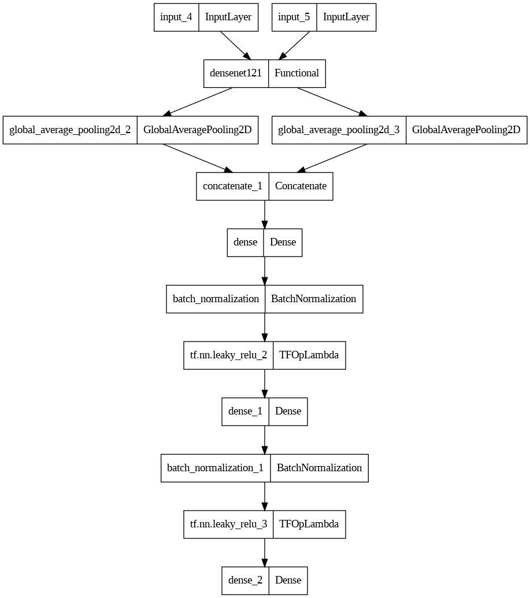

# Face Recognition with Deep Learning
## **Overview**
This project demonstrates a complete workflow for building a face recognition system using deep learning techniques. The system leverages transfer learning with the pre-trained DenseNet121 model, utilizing the CelebA dataset and TensorFlow for model training and evaluation. The model is trained on a GPU with mixed precision enabled to optimize performance. It employs a Siamese network architecture to learn facial similarities and uses Euclidean distance for face verification.

## **Workflow**

The primary task of this notebook is face recognition. It identifies whether two given images represent the same person.

## Environment Setup:

**GPU Configuration**: The notebook checks if a GPU is available and enables mixed precision if it is, which significantly improves training efficiency.
*Mixed Precision Training*:

Mixed precision uses both 16-bit and 32-bit floating-point types during training. This technique speeds up training and reduces memory usage while maintaining model accuracy.
Benefits: By using mixed precision, the model trains faster and more efficiently, especially when using a GPU.

*Kaggle API Key Configuration*:

The Kaggle API Key is configured to allow seamless downloading of datasets. This involves setting up the directory where Kaggle configuration files are stored.

*Dataset Handling:*

Download: The CelebA dataset is downloaded from Kaggle. It contains 202599 photos of different celebrities. You can find it [here](https://www.kaggle.com/datasets/jessicali9530/celeba-dataset)

## **Data Preparation and Modeling**:

The training data is prepared in the form of pairs of images. Each pair is labeled with a 1 if the images are of the same person and a 0 if they are not. This setup is crucial for training the Siamese network.

### *Siamese Network*: 
The architecture involves a Siamese network, which consists of two identical subnetworks that share the same weights. This network learns to differentiate between similar and dissimilar pairs of images.
A Siamese network is a type of neural network architecture that learns to identify the similarity between two inputs by comparing their feature representations, below is detailed explaintation of the model architecture.

#### Functionality: 
During training, the network learns to produce similar feature vectors for images of the same person and different vectors for images of different people.
#### Transfer Learning:
The pre-trained DenseNet121 model is leveraged to improve the accuracy and efficiency of the face recognition system.
#### Euclidean Distance: 
The Euclidean distance between the feature vectors of the image pairs is computed to determine the similarity. A smaller distance indicates higher similarity, while a larger distance indicates dissimilarity.
### Evaluation and Inference:

The trained model is evaluated on a validation set to assess its accuracy and generalization capability.
Inference can be performed on new images to demonstrate the model's face recognition capabilities.

## Model Architecture

### *Input Layers*:

The model has two input layers (input_4 and input_5), indicating that it accepts pairs of images as inputs. Each input layer corresponds to one image in the pair.
### *DenseNet121 Backbone*:

The densenet121 component suggests that the DenseNet121 architecture is used as the backbone for feature extraction. DenseNet121 is a convolutional neural network known for its efficiency and connectivity between layers.

### *Global Average Pooling Layers*:

global_average_pooling2d_2 and global_average_pooling2d_3 are Global Average Pooling layers applied to the outputs of the DenseNet121 backbone.
What is Global Average Pooling? Global Average Pooling reduces each feature map to a single value by taking the average of all values in that feature map. This layer reduces the spatial dimensions, making the model more efficient and less prone to overfitting.

### *Concatenation*:

The concatenate_1 layer combines the feature vectors from the two Global Average Pooling layers. This merged representation contains features from both images in the pair.
Dense Layer:

The concatenated features are fed into a Dense (fully connected) layer (dense). This layer learns to further combine and interpret the features extracted by the DenseNet121 backbone.
### *Batch Normalization*:

A batch_normalization layer is applied after the Dense layer.
Benefits of Batch Normalization: Batch normalization normalizes the activations of the previous layer at each batch, stabilizing and speeding up the training process. It reduces the internal covariate shift, allows for higher learning rates, and acts as a regularizer, reducing the need for other regularization techniques like dropout.
### *Activation Functions*:

Leaky ReLU activation functions (tf.nn.leaky_relu_2 and tf.nn.leaky_relu_3) introduce non-linearity into the model, enabling it to learn more complex patterns. Leaky ReLU helps in avoiding the "dying ReLU" problem by allowing a small, non-zero gradient when the unit is not active.
### *Further Dense Layers and Batch Normalization:*

Additional Dense layers (dense_1, dense_2) and Batch Normalization layers (batch_normalization_1) are used to refine the learned features further.
### *Output Layer*:

The final layer computes the Euclidean distance between the feature vectors of the two images. This distance is used to classify whether the faces in the pair of images belong to the same person or not. A smaller Euclidean distance indicates higher similarity, while a larger distance indicates dissimilarity.
## **Summary**
This model uses a Siamese network architecture with DenseNet121 as the backbone, combined with Global Average Pooling, Dense layers, Batch Normalization, and Leaky ReLU activation functions. The output is determined based on the Euclidean distance between the feature vectors of the image pairs, allowing for effective face recognition.
